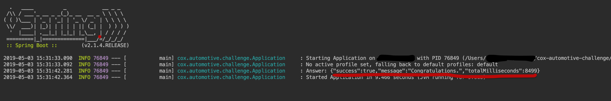

# Cox Automotive Programming Challenge

Using the provided API, create a program that retrieves a datasetID, retrieves all vehicles and dealers for that dataset, and successfully posts to the answer endpoint. Each vehicle and dealer should be requested only once. You will receive a response structure when you post to the answer endpoint that describes status and total ellapsed time; your program should output this response.

The server has a built in delay that varies between 1 and 4 seconds for each request for a vehicle or for a dealer. Focus on optimizing for low total elapsed time between retrieving the datasetid and posting the answer. A successful submission will complete in significantly less than 30 seconds.

Your program should be implemented in the primary language for the position you are applying for. If there is uncertainty about this, please reach out to us. There is information about client code generation here.

The cheat endpoint returns a correct answer for the dataset. It is provided for debugging purposes; it should not be used in your submitted program.

The problem is designed to take approximately 1-2 hours.

Link: http://api.coxauto-interview.com

### How to run the app

```bash
gradle bootRun
```

### How to run test
```bash
gradle test
```

### Result
```json
 {"success":true,"message":"Congratulations.","totalMilliseconds":9593}
```

### App

